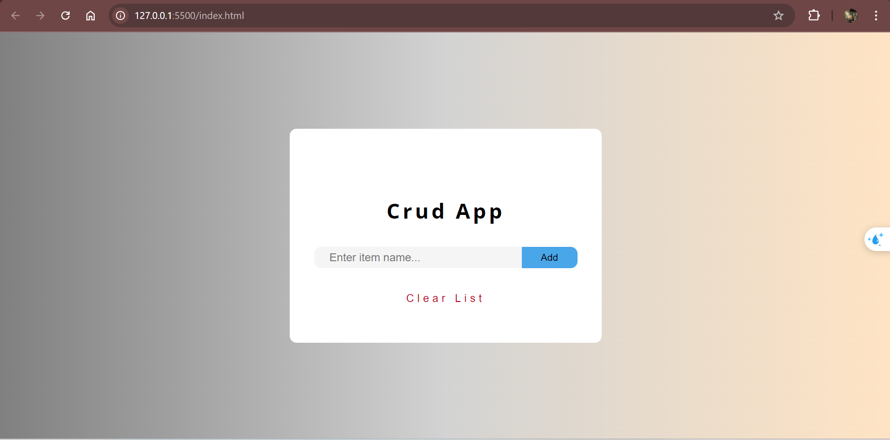
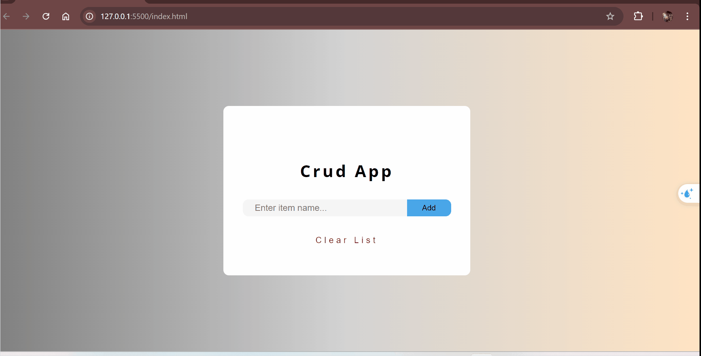

#  Crud App
This project is a CRUD (Create, Read, Update, Delete) application built using HTML, CSS, and JavaScript. The app allows users to manage a list of items, and it saves the data locally using the localStorage API, ensuring that the data persists even after refreshing the page or closing the browser.

# Used Technologies
- HTML for structure.
- CSS for styling and layout.
- JavaScript for dynamic content and interactivity.
- Local Storage: Stores items locally in the browser to maintain data persistence.

# Preview

# GIF

